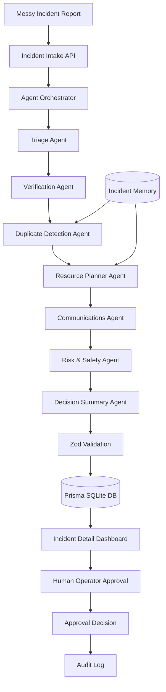

# CrisisOps AI

CrisisOps AI is a Qwen Cloud-powered multi-agent incident command assistant that converts messy emergency reports into verified, prioritized, human-approved response plans.

It is built for low-resource cities, campuses, NGOs, and emergency teams where reports often arrive through fragmented channels and operators need fast, structured decision support.

> **CrisisOps AI is not a chatbot.** It is a human-approved, Qwen-powered, multi-agent command workflow system for turning messy incident reports into structured response decisions.

---

## Hackathon Track

**Primary Track:** Track 4 — Autopilot Agent
**Secondary Fit:** Track 3 — Agent Society · Track 1 — MemoryAgent

---

## One-Liner

CrisisOps AI turns messy emergency reports into structured response plans using seven specialized Qwen Cloud agents, persistent memory, Zod validation, audit logging, and mandatory human approval.

---

## Why It Matters

Emergency response can fail when information is incomplete, duplicated, contradictory, or delayed.

Manual emergency report processing takes **8–15 minutes** to read, classify, verify, draft communication, and prepare an operator checklist.

CrisisOps AI delivers AI-assisted processing in **under 60 seconds** — generating structured triage, missing-information detection, duplicate checks, resource recommendations, safe communication drafts, risk flags, and an approval-ready decision summary.

CrisisOps AI does not replace emergency responders. It helps operators organize messy reports, identify missing details, draft safe communication, and make faster human-approved decisions.

---

## Key Features

- 7 specialized Qwen Cloud agents running in sequence
- Structured JSON outputs validated with Zod schemas
- Automatic retry with repair prompt when JSON is invalid
- Persistent incident memory (keyword-matched retrieval)
- Human approval workflow: Approve / Approve with Edits / Reject / Request More Info
- Public alert drafts always require human approval — never auto-sent
- Full append-only audit log for every agent action and operator decision
- Agent workflow timeline showing pipeline progress
- Duplicate detection surfaced as a dedicated UI card
- Dark emergency-operations dashboard UI
- 4 polished demo scenarios for immediate judge testing

---

## Qwen Cloud Usage

All 7 agents call Qwen Cloud through the OpenAI-compatible endpoint:

```
QWEN_BASE_URL=https://dashscope-intl.aliyuncs.com/compatible-mode/v1
```

| Model | Role |
|-------|------|
| `qwen-max` | All 7 agent reasoning calls (deep analysis) |
| `qwen-plus` | Test route and utility calls |

The Qwen client wrapper (`lib/qwen/client.ts`):
- Calls `chat.completions.create` with structured system + user prompts
- Parses the JSON response
- If JSON parsing fails, retries once with a repair prompt
- Logs only the agent name — never API keys or full prompts
- Returns typed output validated by Zod

---

## Agent Workflow

```
1. Triage Agent          — classify type, severity, urgency, affected people
2. Verification Agent    — detect missing info, contradictions, clarifying questions
3. Duplicate Agent       — compare with memory, flag similar incidents
4. Resource Planner      — recommend resource categories and first actions
5. Communications Agent  — draft internal note, public alert, reporter follow-up
6. Risk & Safety Agent   — evaluate safety, legal, misinformation risks
7. Decision Summary      — create operator checklist and recommended decision
8. Human Approval        — operator reviews and approves before any action
```

Each agent receives prior agents' outputs as context. The orchestrator saves every result to the database and writes an audit log entry.

---

## Architecture



ASCII fallback:

```
[Operator UI] → [Incident Intake API]
                         ↓
     [Incident Database] ←→ [Memory Store]
                         ↓
              [Agent Orchestrator]
                    ↓
     ┌──────────────────────────────────┐
     │  1. Triage Agent                 │
     │  2. Verification Agent           │
     │  3. Duplicate Detection Agent    │
     │  4. Resource Planner Agent       │
     │  5. Communications Agent         │
     │  6. Risk & Safety Agent          │
     │  7. Decision Summary Agent       │
     └──────────────────────────────────┘
                    ↓
     [Zod Validated Structured Outputs]
                    ↓
     [Human Approval UI] → [Audit Log]
```

---

## Human Approval and Safety

CrisisOps AI enforces strict human oversight at every sensitive step:

- **No public alerts are sent automatically.** Every communications draft is marked `requiresApproval: true` and displayed with a prominent warning banner.
- **No emergency resources are auto-dispatched.** The Resource Planner recommends categories; a human operator decides deployment.
- **No dispatch, public alert, or escalation is finalized until an operator reviews and approves the plan.**
- **Approval decisions are stored.** Operators must explicitly choose: Approve / Approve with Edits / Reject / Request More Info.
- **The Risk & Safety Agent evaluates every plan** before it reaches the approval stage, flagging unverified claims and legal risks.
- **All actions are logged** in an append-only audit trail with timestamps.

---

## Tech Stack

| Layer | Technology |
|-------|-----------|
| Frontend | Next.js 16 (App Router), TypeScript, Tailwind CSS |
| Backend | Next.js API Routes |
| AI | Qwen Cloud via OpenAI-compatible SDK (`openai` npm package) |
| Models | `qwen-max` for agents, `qwen-plus` for utilities |
| Database | SQLite via Prisma ORM |
| Validation | Zod (all 7 agent outputs) |

---

## Data Model

| Model | Purpose |
|-------|---------|
| `Incident` | Core incident record with triage fields and status |
| `AgentResult` | Structured JSON output from each agent per incident |
| `Approval` | Operator approval decisions with notes and edits |
| `AuditLog` | Append-only log of all system and operator actions |
| `IncidentMemory` | Persistent cross-incident memory for agent context |

---

## Environment Variables

| Variable | Description | Example |
|----------|-------------|---------|
| `QWEN_API_KEY` | Your Qwen Cloud API key | `sk-...` |
| `QWEN_BASE_URL` | Qwen Cloud OpenAI-compatible endpoint | `https://dashscope-intl.aliyuncs.com/compatible-mode/v1` |
| `QWEN_MODEL` | Primary model for utilities | `qwen-plus` |
| `QWEN_AGENT_MODEL` | Model for all 7 agents | `qwen-max` |
| `DATABASE_URL` | SQLite connection string | `file:./dev.db` |

---

## Local Setup

```bash
# 1. Clone the repo
git clone https://github.com/Ikechukwu-attah/crisisops-ai.git
cd crisisops-ai

# 2. Install dependencies (requires Node.js 20.19+ or 22+)
npm install

# 3. Configure environment variables
cp .env.example .env.local
# Edit .env.local — add your QWEN_API_KEY

# 4. Initialize the database
DATABASE_URL="file:./dev.db" npx prisma db push

# 5. Seed demo memory
DATABASE_URL="file:./dev.db" npx tsx prisma/seed.ts

# 6. Start development server
npm run dev
# Open http://localhost:3000
```

---

## Running the App

```bash
npm run dev          # Development server at http://localhost:3000
npm run build        # Production build
npm run start        # Production server
```

**Verify Qwen connection:**
```
GET http://localhost:3000/api/qwen-test
```

**Re-seed memory via API:**
```
POST http://localhost:3000/api/memory/seed
```

---

## Demo Scenarios

Click the demo fill buttons on the New Incident page to test each scenario instantly:

### 1. Flooding + Trapped Residents
```
Flooding around Main Street. Water is entering the ground floor of an apartment building.
Power is out. Road access is blocked. Elderly residents may be trapped inside.
```
Tests: triage severity, missing info detection, memory match, resource planning, cautious public alert

### 2. Conflicting Fire / Gas Leak Report
```
People are reporting a fire near Central Market, but another caller says it may be a gas leak.
Smoke is visible. The exact location is unclear, possibly near the east entrance.
```
Tests: contradiction detection, verification risk, duplicate check, unverified claim flagging

### 3. Duplicate Flooding Report
```
Another message came in about flooding near Main Street. Caller says water is rising fast
and people are still inside the same apartment building.
```
Tests: duplicate detection against memory, merge recommendation, location overlap

### 4. Rumor / Misinformation Risk
```
There are rumors online that a bridge has collapsed near Riverside Road.
Traffic is stopped, but there is no official confirmation yet.
```
Tests: verification risk, risk & safety flags, conservative public alert, approval requirement

---

## Deployment Checklist

Before submitting or demonstrating:

- [ ] `QWEN_API_KEY` configured in deployment environment
- [ ] `QWEN_BASE_URL` configured
- [ ] `DATABASE_URL` configured and database initialized
- [ ] `GET /api/qwen-test` returns `{ "success": true }`
- [ ] Demo scenarios work end-to-end and reach `PENDING_APPROVAL`
- [ ] Approval action updates status and writes to audit log
- [ ] Public alert draft always shows "Requires Human Approval"
- [ ] `.env.local` not committed (in `.gitignore`)

> **Note:** SQLite is used for hackathon demo speed. Production deployment should use PostgreSQL with `DATABASE_URL` pointing to a managed database instance.

---

## Alibaba Cloud Deployment

CrisisOps AI is deployed as a single Docker container on Alibaba Cloud ECS.
The full Next.js application (frontend + API routes + agent orchestrator) runs in one container.

### Architecture

```
[Browser]
    │  HTTP / HTTPS
    ▼
[Alibaba Cloud ECS]
    │  Nginx reverse proxy  (port 80 → 3000)
    ▼
[Docker Container: crisisops-ai]
    │  Next.js App Router + API Routes
    │  7-Agent Orchestrator
    ▼
[Qwen Cloud API]
    dashscope-intl.aliyuncs.com/compatible-mode/v1
    qwen-max (agents) · qwen-plus (utilities)
    ▼
[Prisma ORM + SQLite]
    Docker volume: /app/data/production.db
    ▼
[Audit Log + Human Approval Workflow]
```

### Quick Deploy

```bash
# 1. Clone on the ECS instance
git clone https://github.com/Ikechukwu-attah/crisisops-ai.git
cd crisisops-ai

# 2. Set environment variables
export QWEN_API_KEY=your_key_here

# 3. Build and start
docker compose --env-file .env.production up -d --build

# 4. Verify
curl http://localhost:3000/api/health
```

Expected health response:

```json
{
  "status": "ok",
  "service": "crisisops-ai",
  "host": "alibaba-cloud-ready",
  "qwenConfigured": true,
  "timestamp": "..."
}
```

### Full Deployment Guide

See [`docs/ALIBABA_CLOUD_DEPLOYMENT.md`](./docs/ALIBABA_CLOUD_DEPLOYMENT.md) for the step-by-step guide.

### Deployment Proof

See [`docs/DEPLOYMENT_PROOF.md`](./docs/DEPLOYMENT_PROOF.md) for the list of screenshots and evidence required for hackathon submission.

---

## Future Improvements

1. PostgreSQL production database
2. Vector-based semantic incident memory search
3. Live responder availability integration
4. Map-based incident clustering and heatmap
5. SMS/email dispatch after explicit operator approval
6. Role-based operator accounts and permissions
7. Multi-city incident dashboard
8. Offline-first field responder mode
9. Voice-to-text incident intake
10. PDF incident report export

---

## License

MIT — see [LICENSE](./LICENSE)

Built for the Qwen Cloud Global AI Hackathon — Track 4: Autopilot Agent
